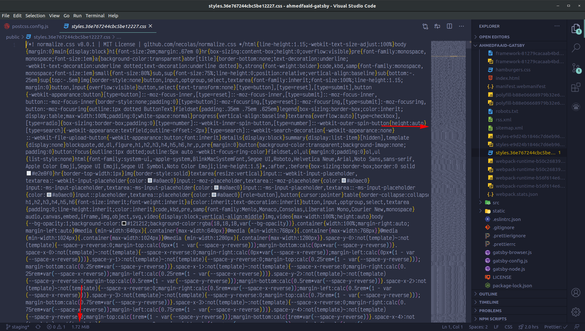
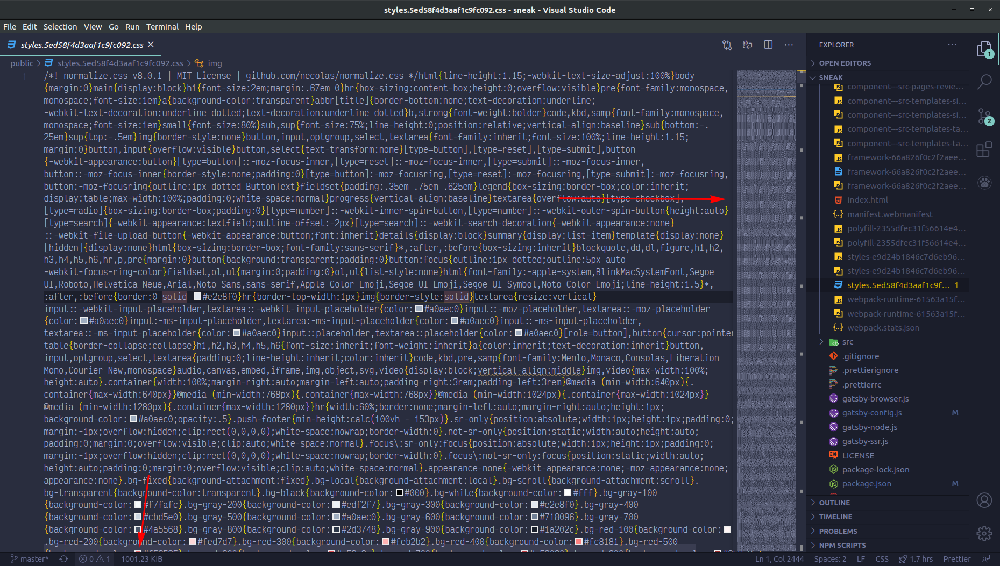
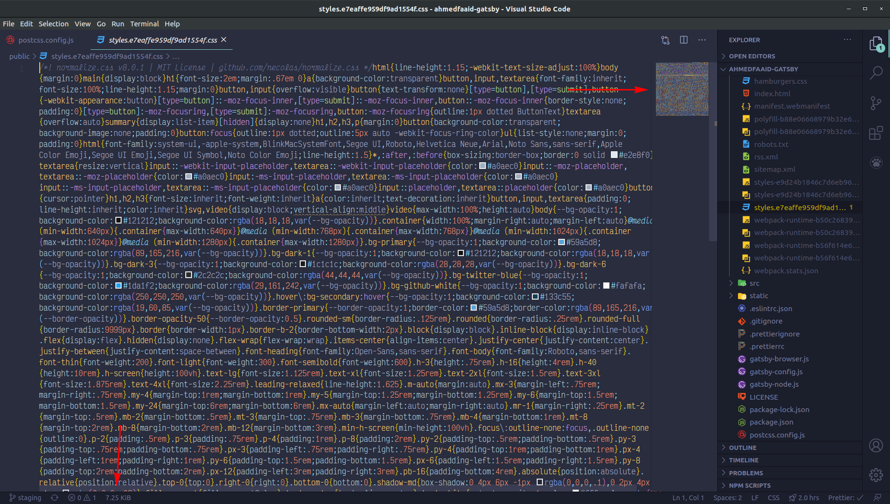
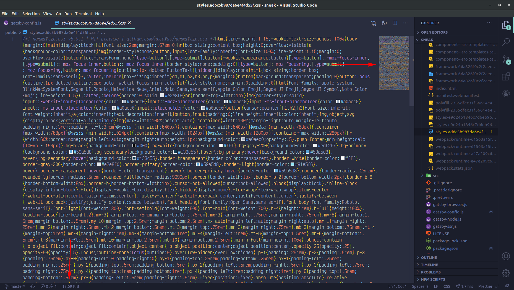

TailwindCSS is a utility-first framework which generates CSS classes based on a configuration file. It is sort of an alternative to Bootstrap or MaterialUI.

<br />

I have a couple of websites built using TailwindCSS. One of them is my <a href='https://ahmedfaaid.com' target='_blank'>personal portfolio website</a> and the other is a <a href='https://sneakersseur.netlify.app' target='_blank'>sneaker news website</a>.

<br />

The problem with TailwindCSS is when you build your project in production, all the generated classes(even the unused ones) are also bundled with the project. This can inflate your bundle sizes and affect the load times for your website especially when your website is client side rendered. This could have many different implications including increased bounce rate and reduced performance.

<br />

I decided to do a little bit of research about the file sizes for the TailwindCSS generated styles. Take a look at these 2 images:

<br />



<br />



<br />

These are the style files that are generated at build time. I want you to notice a few things here. So much code(yes it is minified) and **LOOK AT THE FILE SIZES**. 1.7MB and 1MB respectively. That is a lot for a browser to download and render along with the bundled JavaScript.

<br />

## Purging CSS

TailwindCSS gives you the option to purg the unused CSS that is generated so
hat it is not added to the final build. In my personal portfolio, I used <a href='https://purgecss.com' target='_blank'>purgecss</a> and here is my config file.

<br />

```javascript
/* postcss.config.js */

const tailwindcss = require('tailwindcss');

module.exports = {
  plugins: [
    require('tailwindcss')('tailwind.config.js'),
    require('autoprefixer')(),
    process.env.NODE_ENV === 'production' &&
      require('@fullhuman/postcss-purgecss')({
        content: ['./src/**/*.js', './public/**/*.html'],
        defaultExtractor: content => content.match(/[A-Za-z0-9-_:/]+/g) || [],
      }),
  ],
};
```

<br />

I am adding the purgecss configuration to my postcss configuration _but_, I am only requiring it if I am in the production environment. I want access to all generated styles in my development environment.

<br />

In the sneaker news website, I am using <a href='https://www.gatsbyjs.com/plugins/gatsby-plugin-purgecss/' target='_blank'>gatsby-plugin-purgecss</a> and here is my config:

<br />

```javascript
/* gatsby-config.js */

module.exports = {
  plugins: [
    `gatsby-plugin-postcss`,
    {
      resolve: `gatsby-plugin-purgecss`,
      options: {
        tailwind: true,
        ignore: ['react-responsive-carousel'],
        develop: false,
      },
    },
  ],
};
```

<br />

Here, I am passing tailwind as an option to let the plugin what I am using for this website. I am also ignoring `react-responsive-carousel` which is a package that gives me an easy carousel component. I do not want any of the styles associated with this package to be purged.

<br />

## After The Purge

Look at these images after purging the css:

<br />



<br />



<br />

Take a look at how much code has been removed and **LOOK AT THE FILE SIZES**. 7.25KB and 12.69KB respectively. That is a significant reduction and an easier download for the browser.

## Conclusion

To sum up, TailwindCSS is a very valuable tool for building your projects fast but you shouldn't ship the everything that it generates. You should only include the CSS that is actually used by your project. Using the solutions above are some of the ways to remove all the unused CSS that TailwindCSS generates.

<br />

Hopefully this helps you reduce the bundle sizes of your projects.
